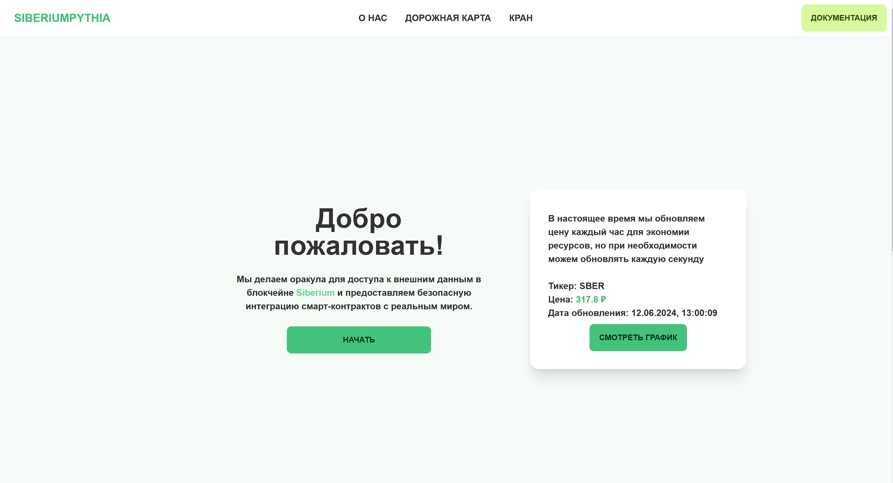
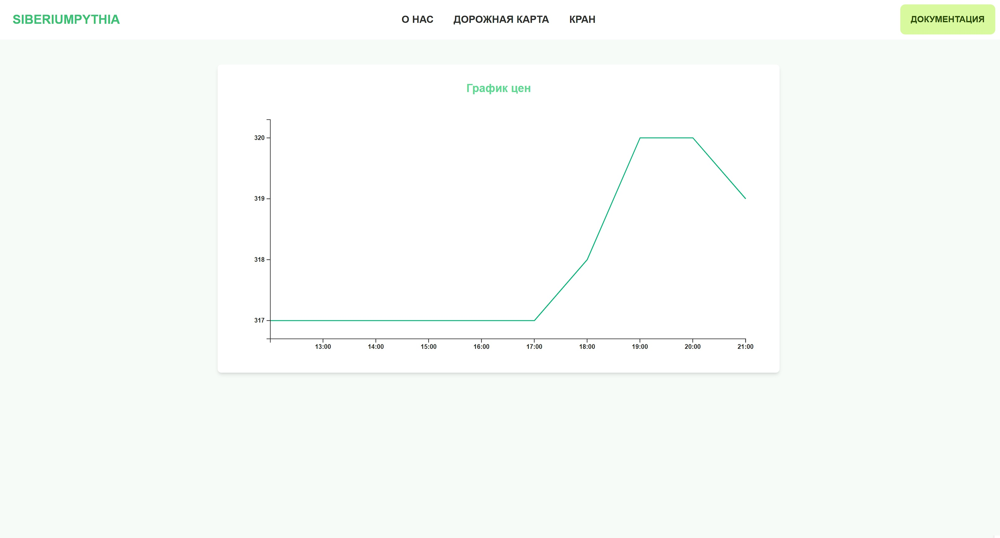

Проект SiberiumPythia — это система оракулов для децентрализованного финансового снабжения данными.

_Вдохновленный Chainlink. Создан с нуля._

## Демонстрационный интерфейс

https://sberhackathon.vercel.app/




## Обзор

Схема может быть представлена в виде ASCII-графики:

```
                       Клиент
                         |
                    PriceOracle
                         |
     +-------------------+----------------------------+
     |                   |                            |
   Символ             Символ                       Символ
     |                   |                            |
     |                   |                            |
   Агрегатор         Агрегатор <== Heartbit      Агрегатор
     |                   |                            |
    ...          +-------+-------+                   ...
                /        |        \
         Transmitter Transmitter Transmitter
```

### Описание компонентов

- Клиент использует, например, getLastPrice из PriceOracle для доступа к последней цене некоторого символа
- PriceOracle является прокси для вызова Symbols, который хранит соответствующий код символа - адрес Symbol
- Symbol - контракт, который хранит историю цен определенного символа и позволяет получить доступ к последней цене (основная функция)
- Aggregator - контракт, который обрабатывает и проверяет входящие цены от Transmitters
- Heartbit — внешний инструмент (скрипт), который периодически вызывает Aggregator для открытия и закрытия так называемых раундов
- Transmitter — скрипт, который слушает событие открытия раунда в Aggregator, извлекает цену из поставщика цен и отправляет ее в Aggregator

### Дополнительная информация

- Для проверки передатчиков используется подпись ECDSA, которую они прикрепляют к транзакции с ценой
- Проверяется отклонение цены от предыдущей известной, задержка ответа на уровне метки времени от передатчика и метки времени транзакции ответа
- Если средняя цена раунда (от всех передатчиков, отправивших цену в Aggregator) не отличается от средней цены предыдущего раунда, то она не сохраняется в Symbol
- Все смарт-контракты принадлежат владельцу и позволяют горячую замену

# Установка и использование

1. Папка `contracts` содержит проект Hardhat, есть скрипт для развертывания всех смарт-контрактов и даже две задачи `transmitterAdd` и `transmitterDelete` для управления списком разрешенных передатчиков в контрактах Aggregator
2. Папка `frontend` — это полноценный интерфейс нашего оракула
3. Папка `heartbit` содержит проект на NodeJS, просто скопируйте его, перейдите в папку и начните использовать команду `node index.js` или используйте PM2 `pm2 start -n heartbit index.js`
4. Папка `transmitter` содержит проект на NodeJS, направленный на извлечение цен от поставщика цен и отправку их каждый раз, когда `heartbit` запускает новый раунд, просто скопируйте его, перейдите в папку и начните использовать команду `node index.js` или используйте PM2 `pm2 start -n transmitter_symbol index.js`, не забудьте обновить `.env` с правильными значениями (посмотрите `.env.example`)
